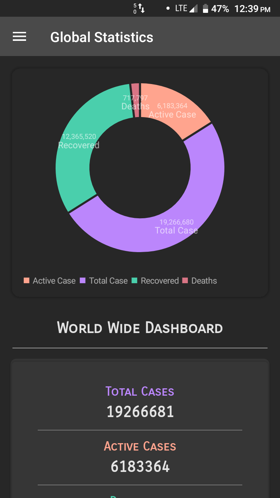
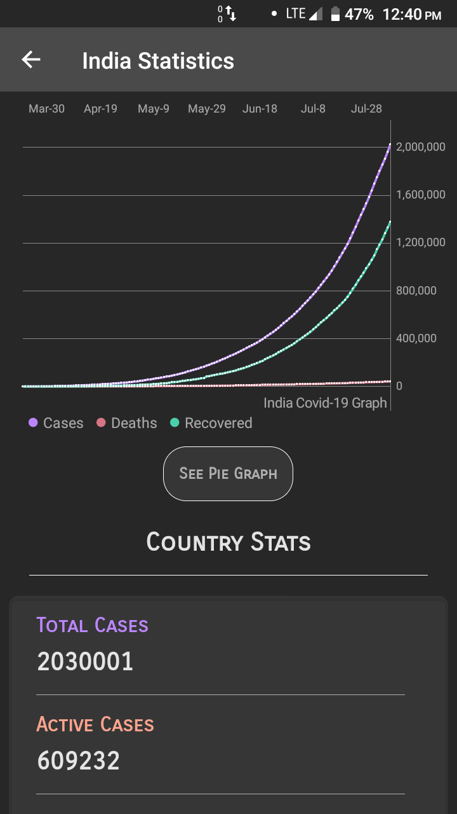
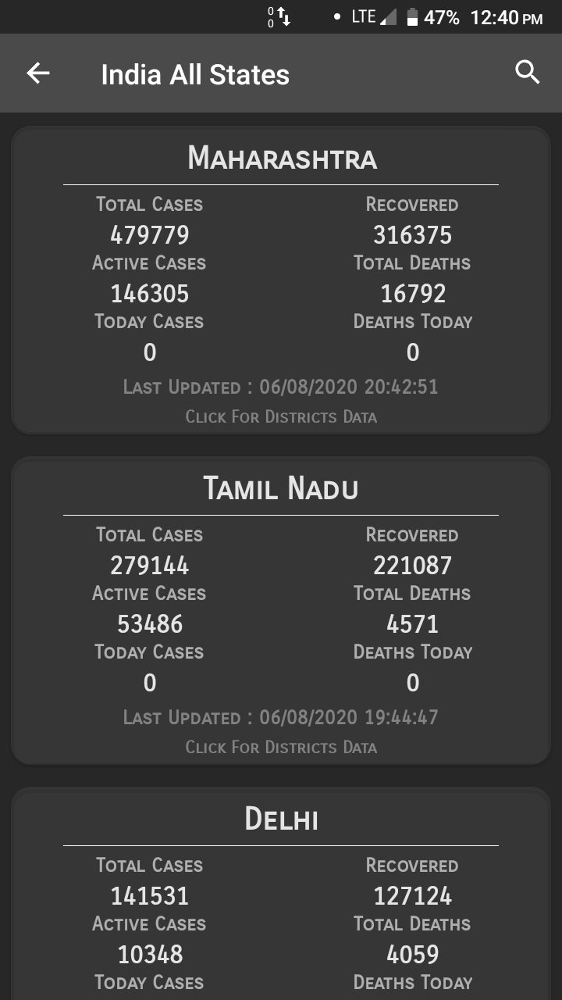
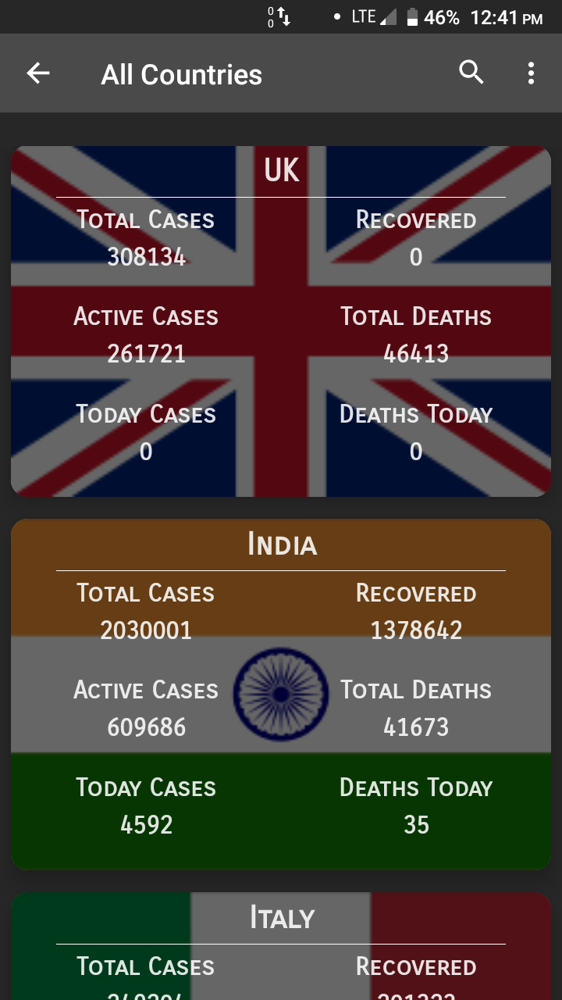
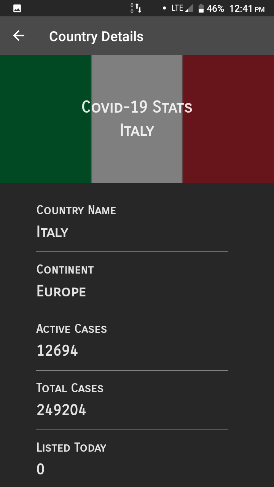
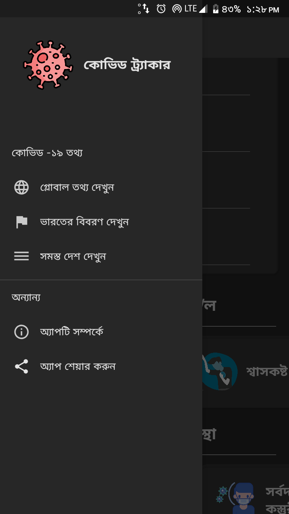

# covid-tracker-kotlin
This app shows covid information from india and all over the globe.This is an upgrade over my previous project named "Covid Tracker" which is also available in my repositories.
This app can help you to be up to date with covid-19 information from any country which you want to see.This app has a separate section for covid information of India.You can go much deep and see information based on districts for every Indian states.
You can see information from all over the globe and from any country which you want.

Here is the link to see java version of this app:https://github.com/SamriddhaS/Covid_Tracker.git

Languages Used : Kotlin,Java,Xml.

Libraries/Features:

1.Designed in mvvm architecture.

2.Local memory caching with room database.

3.Api calls with Retrofit2.

4.Dependency injection with kodein.

5.Kotlin coroutines for background threading.

6.Multiple language support(English,Bengali).

7.Recycler views & "PhilJay" library for graphical representations.

8.Designed with single activity architecture.

9.LiveData,view models,coroutines etc.

Screensorts of the app:

